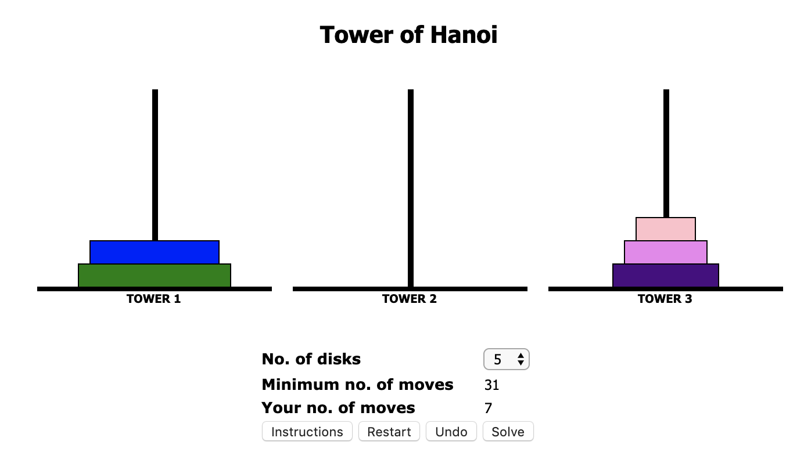

## 1. What is the Big O for this?

1. Determine the Big O for the following algorithm: You are sitting in a room with 15 people. You want to find a playmate for your dog, preferably of the same breed. So you want to know if anyone out of the 15 people have the same breed as your dog. You stand up and yell out, who here has a golden retriever and would like to be a playdate for my golden. Someone yells - "I do, be happy to bring him over"
    * **O(1)**

2. Determine the Big O for the following algorithm: You are sitting in a room with 15 people. You want to find a playmate for your dog who is of the same breed. So you want to know if anyone out of the 15 people have the same breed as your dog. You start with the first person and ask him if he has a golden retriever. He says no, then you ask the next person, and the next, and the next until you find someone who has a golden or there is no one else to ask.
    * **O(n)**

## 2. Even or odd
What is the Big O of the following algorithm? Explain your answer

```
function isEven(value) {
    if (value % 2 == 0) {
        return true;
    }
    else
        return false;
    }
}
```

**O(1):** basic arithmetic operation, doesn't matter what the one integer input is

## 3. Are you here?
What is the Big O of the following algorithm? Explain your answer

```
function areYouHere(arr1, arr2) {
    for (let i = 0; i < arr1.length; i++) {
        const el1 = arr1[i];
        for (let j = 0; j < arr2.length; j++) {
            const el2 = arr2[j];
            if (el1 === el2) return true;
        }
    }
    return false;
}
```

**O(n^2):** two nested loops, need to iterate through both

## 4. Doubler
What is the Big O of the following algorithm? Explain your answer

```
function doubleArrayValues(array) {
    for (let i = 0; i < array.length; i++) {
        array[i] *= 2;
    }
    return array;
}
```

**O(n):** iterate through the full array once, but what you're doing within the iteration is constant time

## 5. Naive search
What is the Big O of the following algorithm? Explain your answer

```
function naiveSearch(array, item) {
    for (let i = 0; i < array.length; i++) {
        if (array[i] === item) {
            return i;
        }
    }
}
```

**O(n):** iterate through the full array once, but what you're doing within the iteration is constant time

## 6. Creating pairs:
What is the Big O of the following algorithm? Explain your answer

```
function createPairs(arr) {
    for (let i = 0; i < arr.length; i++) {
        for(let j = i + 1; j < arr.length; j++) {
            console.log(arr[i] + ", " +  arr[j] );
        }
    }
}
```

**O(n^2):** two nested loops, need to iterate fully through both, actions within each loop is constant time

## 7. Compute the sequence
What does the following algorithm do? What is its runtime complexity? Explain your answer

```
function compute(num) {
    let result = [];
    for (let i = 1; i <= num; i++) {

        if (i === 1) {
            result.push(0);
        }
        else if (i == 2) {
            result.push(1);
        }
        else {
            result.push(result[i - 2] + result[i - 3]);
        }
    }
    return result;
}
```

**O(n):** this is generating a fibonacci sequence array with places based on the input. one "loop" up to the number so if you add a twice as big number, needs to perform twice as many actions.

## 8. An efficient search
In this example, we return to the problem of searching using a more sophisticated approach than in naive search, above. Assume that the input array is always sorted. What is the Big O of the following algorithm? Explain your answer

```
function efficientSearch(array, item) {
    let minIndex = 0;
    let maxIndex = array.length - 1;
    let currentIndex;
    let currentElement;

    while (minIndex <= maxIndex) {
        currentIndex = Math.floor((minIndex + maxIndex) / 2);
        currentElement = array[currentIndex];

        if (currentElement < item) {
            minIndex = currentIndex + 1;
        }
        else if (currentElement > item) {
            maxIndex = currentIndex - 1;
        }
        else {
            return currentIndex;
        }
    }
    return -1;
}
```

**O(log(n)):** splitting the searchable area in half each time

## 9. Random element
What is the Big O of the following algorithm? Explain your answer

```
function findRandomElement(arr) {
    return arr[Math.floor(Math.random() * arr.length)];
}
```

**O(1):** basic arithmetic operation, doesn't matter how big the array input is

## 10. What Am I?
What does the following algorithm do? What is the Big O of the following algorithm? Explain your answer

```
function isWhat(n) {
    if (n < 2 || n % 1 != 0) {
        return false;
    }
    for (let i = 2; i < n; ++i) {
        if (n % i == 0) return false;
    }
    return true;
}
```

**O(n):** this is determining whether the input number is prime. For doubly big input number need to perform double the number of constant time arithmetic operations.


## 11. Tower of Hanoi
The Tower of Hanoi is a very famous mathematical puzzle (some call it game!). This is how it goes:

* There are three rods and a number of disks of different sizes which can slide onto any rod. The puzzle starts with the disks neatly stacked in ascending order of size on one rod, the smallest disk at the top (making a conical shape). The other two rods are empty to begin with.
* The goal of the puzzle is to move the entire stack of rods to another rod (can't be the original rod where it was stacked before) where it will be stacked in the ascending order as well. This should be done obeying the following rules: 
    1. Only one disk may be moved at a time 
    2. Each move consists of taking the upper disk from one of the rods and sliding it onto another rod, on top of the other disks that may already be present on that rod.
    3. A larger disk may not placed on top of a smaller disk

Input:

| Rod A | Rod B | Rod C |
| ----- | ------ | ----- |
| `----` |  |  |
| `---------` |  |  |
| `-------------` |  |  |	

Output:

| Rod A | Rod B | Rod C |
| ----- | ------ | ----- |
| | |`----` |
| | |`---------` |
| | |`-------------` |

Derive an algorithm to solve the Tower of Hanoi puzzle.

* Implement your algorithm using recursion. Your program should display each movement of the disk from one rod to another.
    * **See big-o-drills.js: towerOfHanoi**
* If you are given 5 disks, how do the rods look like after 7 recursive calls?
    * 
    * Image/visualization step-through of the puzzle thanks to [this site](https://www.learneroo.com/modules/71/nodes/402)
* How many moves are needed to complete the puzzle with 3 disks? with 4 disks? with 5 disks?
    * Required steps are 2^n - 1
    * 5 disks = 31 steps
    * 4 disks = 15 steps
    * 3 disks = 7 steps
* What is the runtime of your algorithm?
    * Given the above, we are looking at exponential runtime, O(2^n)

## 12. Iterative version
Solve the drills 1 - 7 from your previous checkpoint (Recursion) iteratively.

### 1. Counting Sheep

Write a recursive function that counts how many sheep jump over the fence. Your program should take a number as input. That number should be the number of sheep you have. The function should display the number along with the message "Another sheep jumps over the fence" until no more sheep are left.

```
Input: 3
Output:
3: Another sheep jumps over the fence
2: Another sheep jumps over the fence
1: Another sheep jumps over the fence
All sheep jumped over the fence
```

**See big-o-drills.js: countSheep**

### 2. Power Calculator

Write a function called powerCalculator() that takes two parameters, an integer as a base, and another integer as an exponent. The function returns the value of the base raised to the power of the exponent. Use only exponents greater than or equal to 0 (positive numbers)

```
powerCalculatorRec(10,2) should return 100
powerCalculatorRec(10,-2) should return exponent should be >= 0
```

**See big-o-drills.js: powerCalculator**

### 3. Reverse String
Write a function that reverses a string. Take a string as input, reverse the string, and return the new string.

**See big-o-drills.js: reverseString**

### 4. nth Triangular Number

Calculate the nth triangular number. A triangular number counts the objects that can form an equilateral triangle. The nth triangular number is the number of dots composing a triangle with n dots on a side, and is equal to the sum of the n natural numbers from 1 to n. This is the Triangular Number Sequence: 1, 3, 6, 10, 15, 21, 28, 36, 45.

```
                          *
            *           *    *
*     |   *   *  |   *    *    *  |

 1st       2nd           3rd             nth?  
```

**See big-o-drills.js: triNum**

### 5. String Splitter
Write a recursive function that split a string based on a separator (similar to String.prototype.split). Don't use JS array's split function to solve this problem.

Input: 02/20/2020
Output: 02202020

**See big-o-drills.js: splitString**

### 6. Fibonacci
Write a recursive function that prints the Fibonacci sequence of a given number. The Fibonacci sequence is a series of numbers in which each number is the sum of the 2 preceding numbers. For example, the 7th Fibonacci number in a Fibonacci sequence is 13. The sequence looks as follows: 1, 1, 2, 3, 5, 8, 13.

**See big-o-drills.js: fibonacci**

### 7. Factorial
Write a recursive function that finds the factorial of a given number. The factorial of a number can be found by multiplying that number by each number between itself and 1. For example, the factorial of 5 is 5 * 4 * 3 * 2 * 1 = 120.

**See big-o-drills.js: factorial**

## 13. Recursive Big O
Take your solutions from the recursive exercises that you completed in the previous checkpoint and identify the time complexities (big O) of each of them.

1. Counting Sheep: O(n): base case is constant time, and fn is called n times based on input
2. Power Calculator: O(n): base case is constant time, and fn is called n times based on input
3. Reverse String: O(n): as the string gets longer, number of fn calls increases linearly, base case constant time
4. nth Triangular Number: O(n): base case is constant time, and fn is called n times based on input
5. String Splitter: O(n): as the string gets longer, number of fn calls increases linearly, base case constant time
6. Fibonacci: O(2^n): exponential, because the time complexity of each call is constant (base case) + (n-1) calls + (n-2) calls... more explanation (that I didn't 100% follow) [found online](https://stackoverflow.com/questions/360748/computational-complexity-of-fibonacci-sequence)
7. Factorial: O(n): base case is constant time, and fn is called n times based on input

## 14. Iterative Big O
Take your solutions from the iterative exercises today and identify the time complexities (big O) of each of them.

1. Counting Sheep: O(n): as the number gets higher, number of actions increase linearly
2. Power Calculator: O(1): this is a constant arithemetic function
3. Reverse String: O(n): as the string gets longer, number of actions increase linearly
4. nth Triangular Number: O(n): as the number gets higher, number of actions increase linearly
5. String Splitter: O(n): as the string gets longer, number of actions increase linearly
6. Fibonacci: O(n): as the number gets higher, number of constant-time arithmetic operations increases linearly
7. Factorial: O(n): as the number gets higher, number of constant-time arithmetic operations increases linearly

