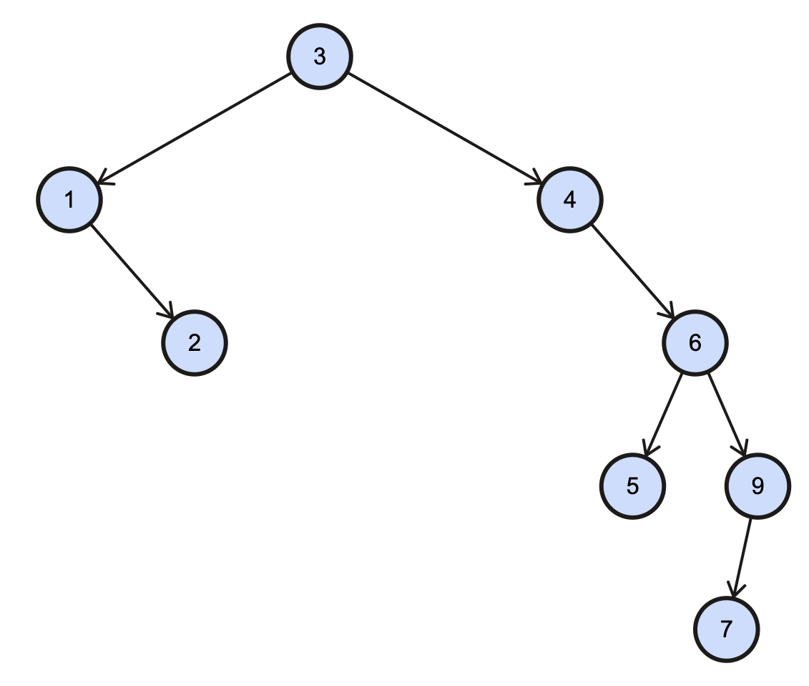
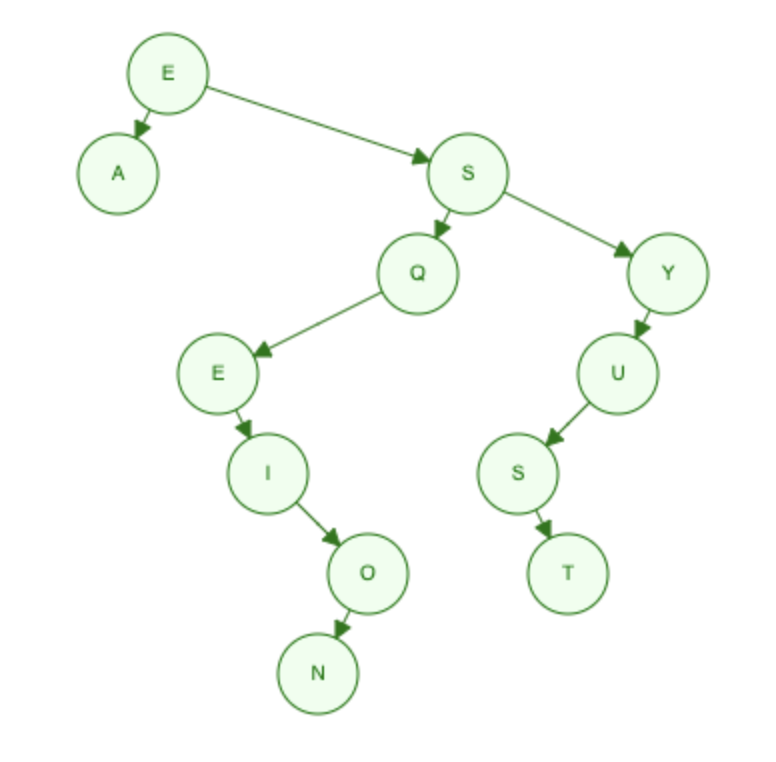
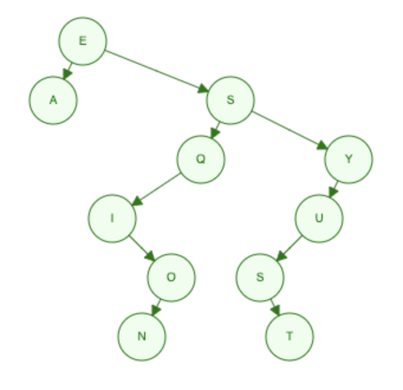

## 1. Draw a BST
* Given the data 3,1,4,6,9,2,5,7, if you were to insert this into an empty binary search tree, what would the tree look like? (Draw the tree, no coding needed here.)



* Draw the BST with the keys - E A S Y Q U E S T I O N



## 2. Remove the root
Show how the above trees would look like if you deleted the root of each tree. (Draw the trees, no coding needed here.)




## 3. Create a BST class
Walk through the binary search tree code in the curriculum and understand it well. Then write a BinarySearchTree class with its core functions (insert(), remove(), find()) from scratch.

* Create a binary search tree called BST and insert 3,1,4,6,9,2,5,7 into your tree. Compare your result with the result from the 1st exercise.
* Create a binary search tree called BST and insert E A S Y Q U E S T I O N into your tree. Compare your result with the result from the 1st exercise.

**See bst.js & bst-drills.js: drill3nums, drill3letts**

## 4. What does this program do?
Without running this code in your code editor, explain what the following program does. Show with an example the result of executing this program. What is the runtime of this algorithm?

```
function tree(t){
    if(!t){
        return 0;
    }
    return tree(t.left) + t.value + tree(t.right)
}
```

* This function adds up all values of the binary tree (it adds left child + current node + right child recursively down the tree)
* Runtime = O(n), it needs to touch every node in the tree

## 5. Height of a BST
Write an algorithm to find the height of a binary search tree. What is the time complexity of your algorithm?

**See bst-drills.js: findHeight**

**Time complexity:** O(n), as algorithm needs to touch every node to count it

## 6. Is it a BST?
Write an algorithm to check whether an arbitrary binary tree is a binary search tree, assuming the tree does not contain duplicates.

**See bst-drills.js: isBST**

## 7. 3rd largest node
Write an algorithm to find the 3rd largest node in a binary search tree.

**See bst-drills.js: kLargest**

## 8. Balanced BST
Write an algorithm that checks if a BST is balanced (i.e., a tree where no 2 leaves differ in distance from the root by more than 1).

**See bst-drills.js: isBalanced**

## 9. Are they the same BSTs?
You are given two arrays which represent two sequences of keys that are used to create two binary search trees. Write a program that will tell whether the two BSTs will be identical or not without actually constructing the tree. You may use another data structure such as an array or a linked list but don't construct the BST. What is the time complexity of your algorithm? E.g., 3, 5, 4, 6, 1, 0, 2 and 3, 1, 5, 2, 4, 6, 0 are two sequences of arrays but will create the exact same BSTs and your program should return true.

**See bst-drills.js: identicalTrees**